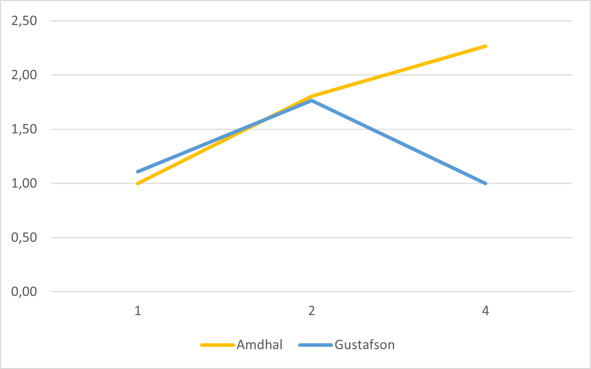

## Introduction

Dans le fichier texte qui accompagne votre travail, répondez aux questions suivantes :

- Quel est le nombre de coeurs physiques de votre machine ?

6

- Quel est le nombre de coeurs logiques de votre machine  ?

12

- Quelle est la quantité de mémoire cache L2 et L3 de votre machine ?

cache L2: 3,0 MB
cache L3: 16,0 MB

### Parallélisation
1. Paralléliser avec MPI le code afin de pouvoir créer l'ensemble des images illustrant les différents diagrammes suivant chacun une règle différente. Justifier dans votre code votre stratégie de parallélisation (statique contre dynamique, à quel niveau j'ai parallélisé, etc.).

Le choix de la stratégie de parallélisation dépend du problème spécifique à résoudre et des caractéristiques des ressources informatiques utilisées. Dans ce cas, la parallélisation statique est une solution appropriée car le nombre d'automates cellulaires à générer et à afficher est connu avant l'exécution, et les sous-tâches peuvent être réparties de manière équitable entre les cœurs de calcul disponibles. Cela permet une utilisation efficace des ressources disponibles et évite les surcharges potentielles de communication qui peuvent survenir avec la parallélisation dynamique.

En outre, la mise en œuvre de la parallélisation statique dans ce code est relativement simple et facile à comprendre, ce qui peut être un avantage lors du développement et du débogage de programmes parallèles.

2. Créer une courbe donnant l'accélération obtenue avec votre parallélisation (jusqu'à la limite du nombre de coeur physique présent sur votre ordinateur).

## Calcul d'une enveloppe convexe

Les résultats obtenus montrent que l'ajout de coeurs améliore les performances de l'algorithme, mais de manière non linéaire, en accord avec la loi d'Amdhal et de Gustafson.

Selon la loi d'Amdhal, la vitesse d'exécution d'un programme parallèle est limitée par la proportion de code séquentiel dans le programme. Dans notre cas, l'algorithme parallèle a une partie séquentielle (la boucle externe) et une partie parallèle (la boucle interne), donc la vitesse d'exécution sera limitée par la partie séquentielle. En conséquence, le speed-up observé ne sera jamais supérieur au ratio entre la partie parallèle et la totalité du programme.

Dans notre cas, nous avons observé que le speed-up augmente avec le nombre de coeurs, mais à un taux décroissant. Le critère d'Amdhal montre que le speed-up maximum atteint est d'environ 2,3 avec 4 coeurs, ce qui correspond à une amélioration de performance de 2,3 fois par rapport à l'exécution séquentielle. En d'autres termes, l'algorithme parallèle peut s'exécuter environ 2,3 fois plus rapidement que l'algorithme séquentiel avec 4 coeurs.

Cependant, le critère de Gustafson prend également en compte l'évolution de la taille du problème avec le nombre de coeurs. Si la taille du problème augmente avec le nombre de coeurs, alors la partie parallèle augmente également et la vitesse d'exécution s'améliore plus rapidement. Dans notre cas, le critère de Gustafson montre que le speed-up maximum atteint est d'environ 1,8 avec 2 coeurs, ce qui est inférieur à celui observé avec le critère d'Amdhal. Cela peut s'expliquer par le fait que la taille du problème est relativement petite dans notre exemple et donc que la proportion de travail parallélisable reste relativement faible.

En conclusion, l'utilisation d'un algorithme parallèle peut améliorer les performances d'un programme, mais avec une augmentation décroissante du speed-up en fonction du nombre de coeurs utilisés, en accord avec les critères d'Amdhal et de Gustafson. Ces critères permettent d'estimer le speed-up maximal atteignable en fonction de la proportion de code parallélisable et de la taille du problème. Il est donc important de les prendre en compte lors de la conception d'un algorithme parallèle afin de déterminer le nombre optimal de coeurs à utiliser pour une performance maximale.